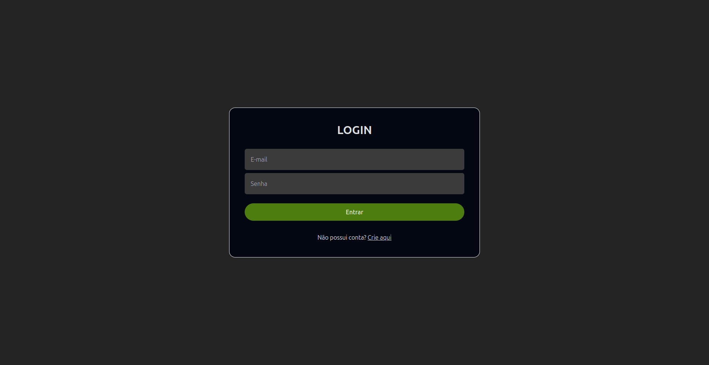
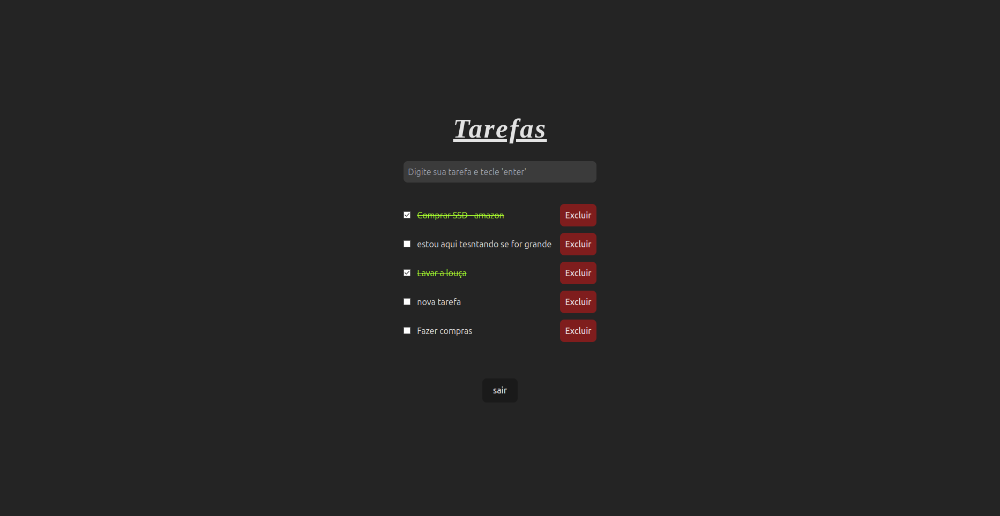

# Gerenciador de Tarefas com Sistema de Login

> [**Preview do Gerenciador (Live App)**](https://vuefire2023.web.app)

O projeto em questão é um **Gerenciador de tarefas** com sistema de autenticação para usuários. O Projeto permite o cadastro de novos usuários e o login dos mesmos, sendo assim cada usuário terá sua própria coleção de tarefas que serão indenpendentes dos demais usuários.

| Login   | Registrar | Lista de Tarefas
|----------|---------|---------|
|  |   |  |

## Tecnologias Utilizadas

- Vue.js 3
- Typescript
- Vuefire
- Firebase 9
- Vite
- Tailwind

## Objetivo

O objetivo deste projeto foi o estudo do Firebase em conjunto com Vuefire e seus recursos como:

- Firebase Authentication
- Firebase Hosting
- Firestore Database
